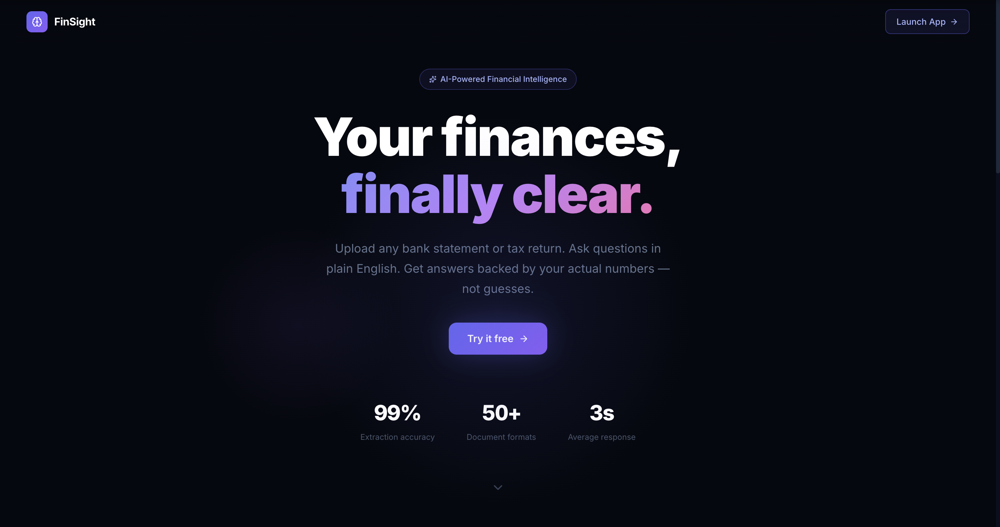
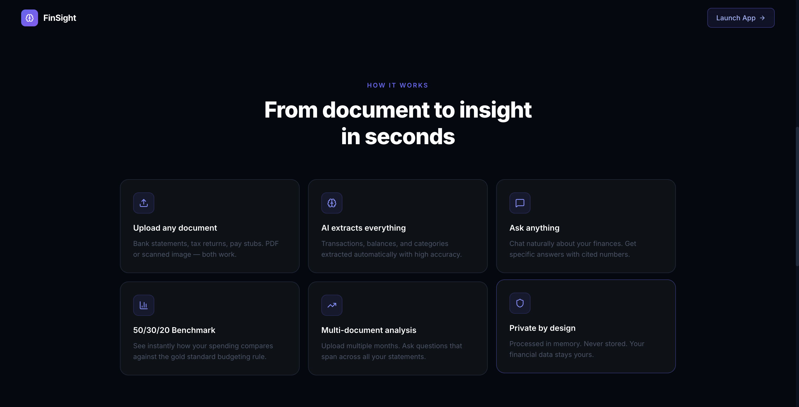
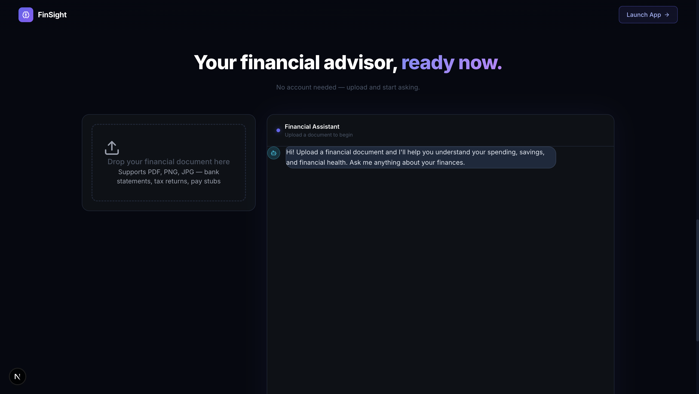
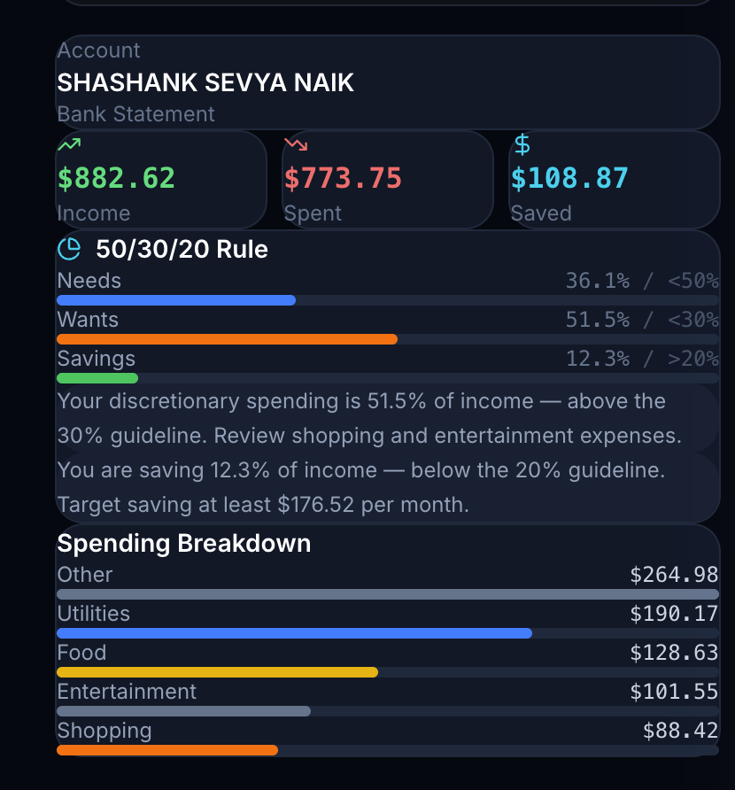
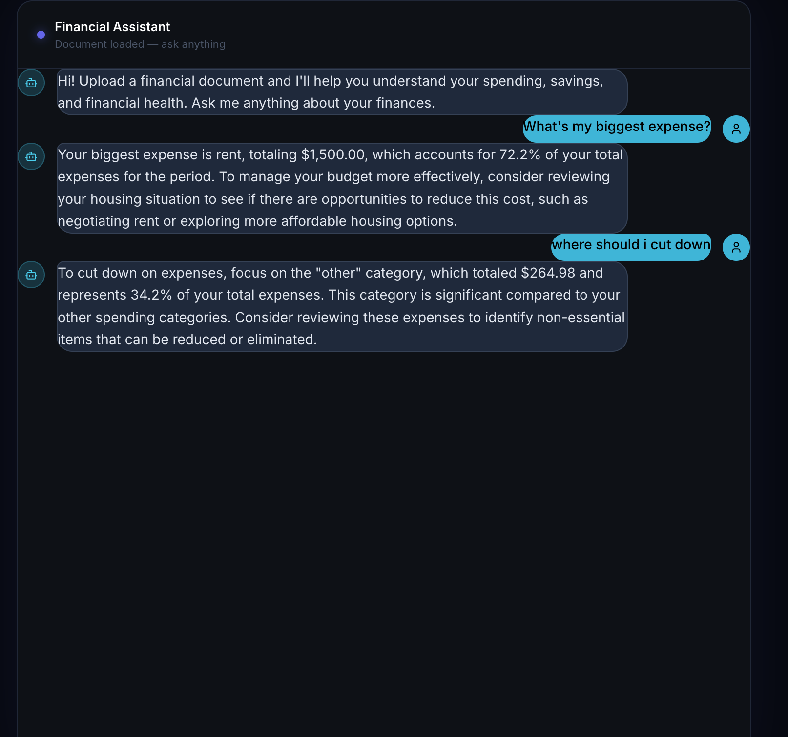

# FinSight — Personal Financial Document Intelligence

> Upload your bank statements, tax returns, or pay stubs. Ask anything about your finances in plain English. Get answers backed by your actual numbers.



---

## What it does

Most people have no idea where their money actually goes. FinSight lets you upload any financial document and have a real conversation about it — no bank login, no manual data entry, no generic pie charts.

- **Works on any document** — native PDFs, scanned statements, images
- **Asks real questions, gets real answers** — "Am I saving enough?" returns a specific percentage with cited data
- **Benchmarks your spending** — automatic 50/30/20 rule analysis with personalized recommendations
- **Remembers context** — follow-up questions work without repeating yourself
- **Never stores your data** — everything processed in memory per session

---

## Screenshots

### Landing Page


### Features


### App — Upload + Dashboard + Chat


### Spending Breakdown + 50/30/20 Benchmark


### Conversational Q&A with Memory


---

## Architecture

```
User Uploads Document (PDF / scanned image)
             │
             ▼
   ┌─────────────────────┐
   │   Document Parser    │  PyMuPDF + pdfplumber + Tesseract OCR
   │  (native + scanned)  │  Auto-detects scanned docs, triggers OCR
   └─────────┬───────────┘
             │
             ▼
   ┌─────────────────────┐
   │  Structured          │  3 separate LLM calls:
   │  Extractor           │  → Transactions (date, amount, category)
   │                      │  → Period summary (balances, dates)
   │                      │  → Document metadata (holder, bank, type)
   └─────────┬───────────┘
             │
             ▼
   ┌─────────────────────┐
   │  Programmatic        │  Python calculates all totals,
   │  Calculator          │  percentages, category breakdowns
   │                      │  LLM never does math
   └─────────┬───────────┘
             │
             ▼
   ┌─────────────────────┐
   │  Semantic Chunker    │  Chunks by financial meaning:
   │                      │  → 1 chunk per transaction
   │                      │  → 1 chunk per category summary
   │                      │  → 1 overall period summary chunk
   └─────────┬───────────┘
             │
             ▼
   ┌─────────────────────┐
   │  Embedder            │  text-embedding-3-small (1536-dim)
   │  → Qdrant Vector DB  │  Cosine similarity, metadata payload
   └─────────┬───────────┘
             │
        User asks question
             │
             ▼
   ┌─────────────────────┐
   │  RAG Query Engine    │  Embeds query → retrieves top-5 chunks
   │                      │  → LLM generates answer with citations
   │                      │  → Returns answer + sources
   └─────────┬───────────┘
             │
             ▼
   ┌─────────────────────┐
   │  Conversation Layer  │  Full message history maintained
   │                      │  Follow-up questions work natively
   └─────────────────────┘
```

---

## Key Technical Decisions

### 1. LLM for understanding, Python for math
The LLM extracts transactions and categories. All totals, percentages, and net cashflow are calculated programmatically. This is a deliberate architectural decision — during development, the LLM reported `$578.48` in total debits when the real value was `$2078.48`. Python caught it. Financial applications cannot afford hallucinated numbers.

### 2. Semantic chunking over positional chunking
Standard RAG splits documents by page number or character count. FinSight chunks by financial meaning — one chunk per transaction, one per category summary, one overall period chunk. Asking about food expenses retrieves food chunks, not unrelated pages. This makes retrieval precise and answers specific.

### 3. Three-pass structured extraction
A single monolithic extraction prompt produces lower accuracy. FinSight uses three separate LLM calls — transactions, summary, metadata — each with a focused prompt and strict JSON output. Every call uses `temperature=0` for deterministic extraction and strips markdown fences before `json.loads()`.

### 4. Stateful conversation, stateless documents
Documents are processed once and cached to disk. Conversation history is maintained in memory as a `[{role, content}]` list, appended to every API call. This enables natural follow-up questions like "Is that too much?" without the user repeating context.

### 5. Multi-document aggregation
The `MultiDocManager` processes each document independently through the full pipeline, then aggregates transactions, credits, debits, and category spending across all documents. This enables cross-document queries like "compare my March and April spending."

---

## Tech Stack

| Layer | Technology | Why |
|-------|-----------|-----|
| Document parsing | PyMuPDF, pdfplumber | Fast native PDF text + table extraction |
| OCR | Tesseract + pdf2image | Scanned document support |
| LLM | GPT-4o-mini | Cost-efficient, accurate structured extraction |
| Embeddings | text-embedding-3-small | 1536-dim, best cost/quality balance |
| Vector DB | Qdrant | Fast cosine search, rich metadata payloads |
| Backend | FastAPI | Async, typed, auto-docs at /docs |
| Frontend | Next.js 14 + Tailwind | App router, SSR-ready |
| Animation | Framer Motion | Scroll-triggered reveals, chat animations |

---

## Running Locally

### Prerequisites
- Python 3.10+
- Node.js 18+
- Docker (for Qdrant)
- OpenAI API key

### Backend

```bash
# Clone the repo
git clone https://github.com/YOUR_USERNAME/finsight.git
cd finsight

# Create virtual environment
python3 -m venv venv
source venv/bin/activate

# Install dependencies
pip install -r requirements.txt

# Install system dependencies (Mac)
brew install tesseract poppler

# Add your API key
cp .env.example .env
# Edit .env and add: OPENAI_API_KEY=your_key_here

# Start Qdrant
docker run -p 6333:6333 -v $(pwd)/qdrant_storage:/qdrant/storage qdrant/qdrant

# Start backend (new terminal, venv activated)
python3 -m uvicorn backend.main:app --reload --port 8000
```

### Frontend

```bash
cd frontend
npm install
npm run dev
```

Open **http://localhost:3000**

### API Docs
FastAPI auto-generates interactive docs at **http://localhost:8000/docs**

---

## API Reference

### Upload Document
```
POST /api/upload
Content-Type: multipart/form-data

file: <PDF or image>

Returns: metadata, calculated_summary, benchmark
```

### Query
```
POST /api/query
Content-Type: application/json

{
  "question": "How much did I spend on food?",
  "conversation_id": "session_123"
}

Returns: answer, sources, question
```

### Reset Conversation
```
POST /api/reset/{conversation_id}
```

### List Documents
```
GET /api/documents
```

---

## Project Structure

```
finsight/
├── src/
│   ├── ingestion/
│   │   ├── document_loader.py       # PDF + OCR pipeline
│   │   ├── chunker.py               # Semantic financial chunking
│   │   └── embedder.py              # Qdrant vector storage
│   ├── extraction/
│   │   ├── structured_extractor.py  # 3-pass LLM extraction
│   │   ├── query_engine.py          # RAG retrieval + generation
│   │   ├── benchmarker.py           # 50/30/20 rule analysis
│   │   └── conversation.py          # Stateful chat memory
│   └── utils/
│       ├── calculator.py            # Programmatic financial math
│       ├── storage.py               # Document caching
│       └── multi_doc_manager.py     # Multi-document orchestration
├── backend/
│   ├── main.py                      # FastAPI app + CORS
│   ├── routers/
│   │   ├── documents.py             # Upload + list endpoints
│   │   └── query.py                 # Chat + reset endpoints
│   └── models/
│       └── schemas.py               # Pydantic request/response models
├── frontend/
│   ├── app/
│   │   ├── page.tsx                 # Landing page + app section
│   │   ├── layout.tsx               # Root layout
│   │   └── components/
│   │       ├── FileUpload.tsx       # Drag-and-drop upload
│   │       ├── Dashboard.tsx        # Metrics + benchmark + spending
│   │       └── ChatInterface.tsx    # Conversational chat UI
│   └── globals.css
├── docs/
│   └── screenshots/                 # UI screenshots for README
├── data/
│   ├── uploads/                     # Document uploads (gitignored)
│   └── processed/                   # Cached extractions (gitignored)
├── requirements.txt
├── .env.example
└── README.md
```

---

## Roadmap

- [ ] Merchant name enrichment for generic POS transactions
- [ ] Multi-month trend charts with Chart.js
- [ ] Export full analysis as PDF report
- [ ] Support for investment account statements (brokerage, 401k)
- [ ] Anomaly detection — flag unusual transactions automatically
- [ ] Mobile-responsive layout

---

## License

MIT